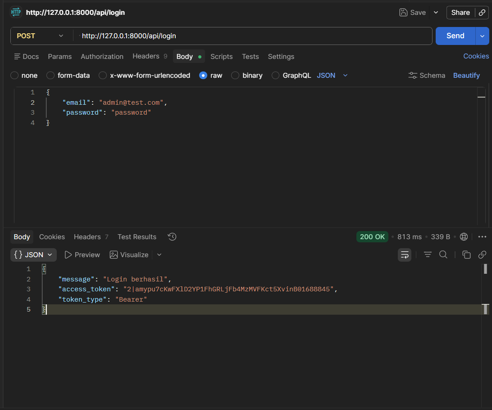
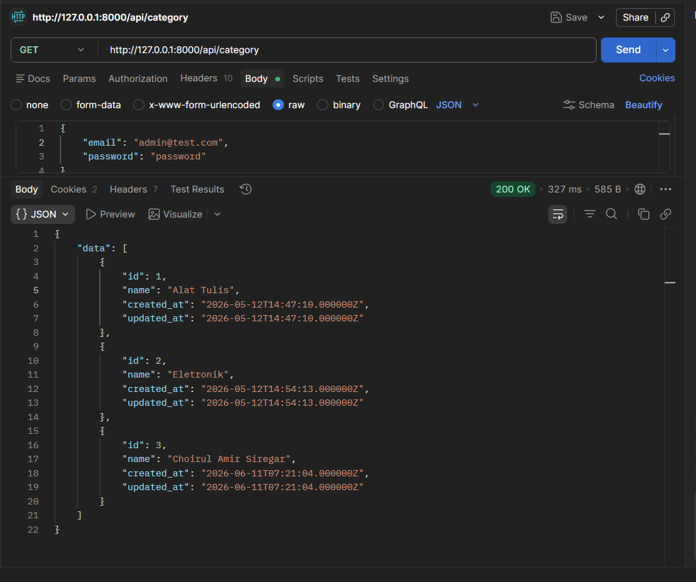
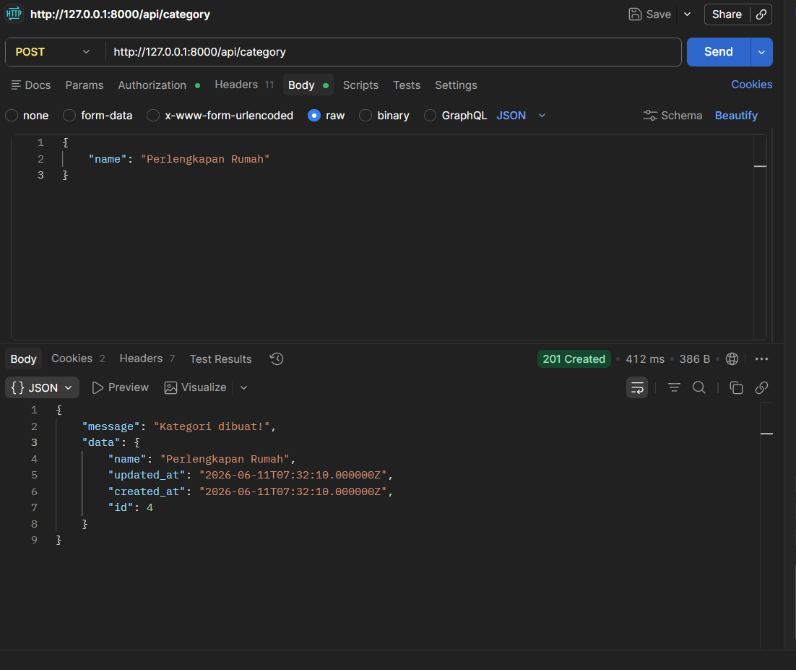
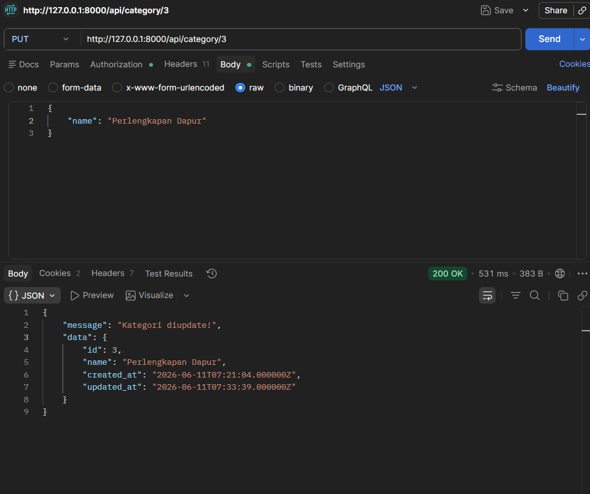
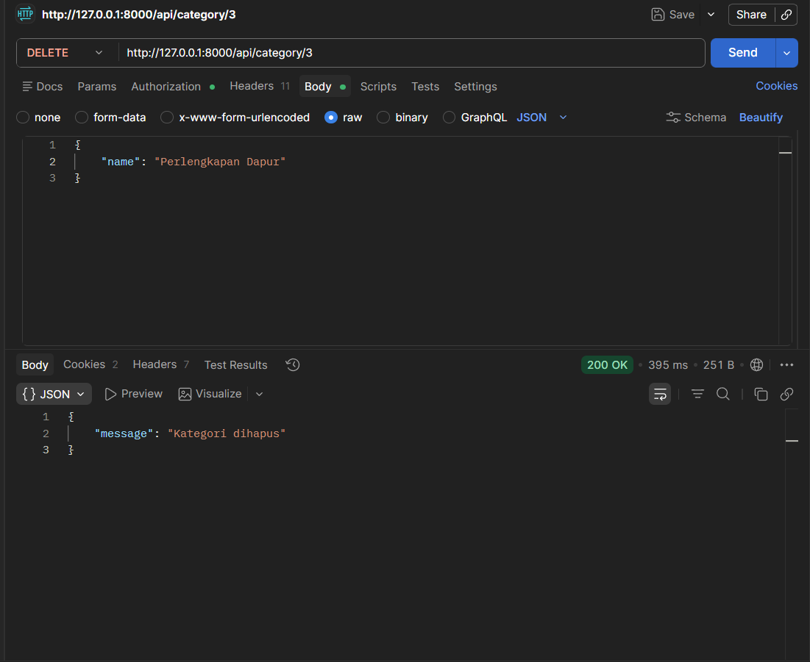
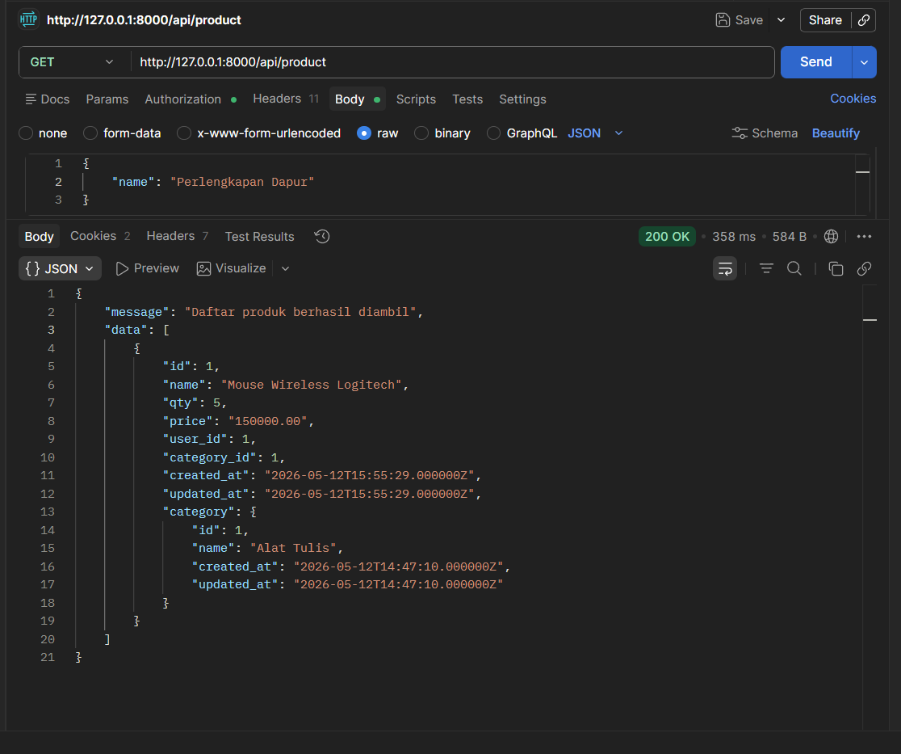
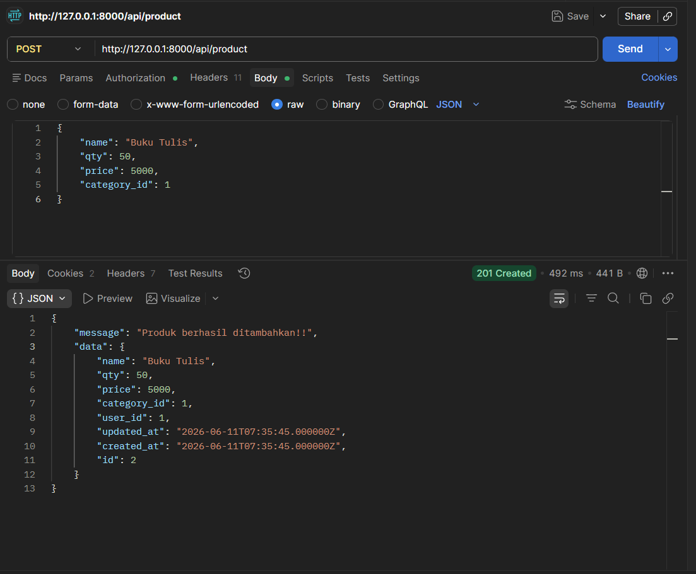
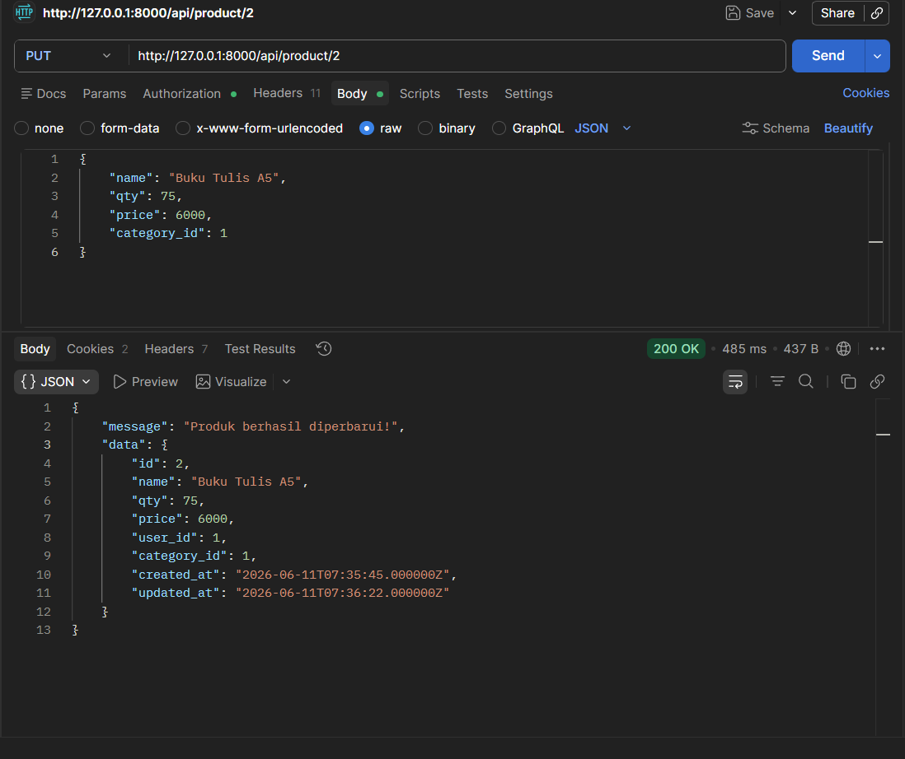
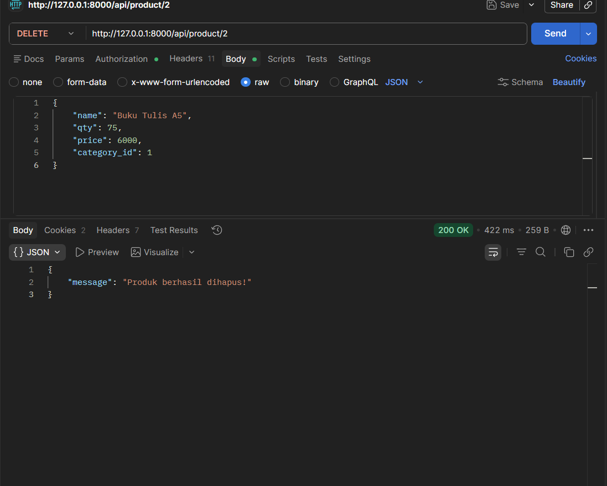

<p align="center"><a href="https://laravel.com" target="_blank"></a></p>

<p align="center">


</p>

---

# PWF — Pemrograman Web Framework

Proyek Laravel untuk mata kuliah **Pemrograman Web Framework** — Program Studi Informatika.

---

## 📚 Daftar Pertemuan

| Pertemuan | Topik |
|-----------|-------|
| Pertemuan 1 | Instalasi & Setup Laravel |
| Pertemuan 2 | Routing & Controller |
| Pertemuan 3 | Blade Template & View |
| Pertemuan 5 | Database & Eloquent ORM |
| Pertemuan 6 | Authentication (Laravel Breeze) |
| Pertemuan 9 | **API CRUD dengan Laravel Sanctum** ✅ |

---

## 🔌 Pertemuan 9 — API CRUD (Laravel Sanctum)

### Tujuan Pembelajaran
Memahami cara membangun RESTful API dengan Laravel menggunakan **Laravel Sanctum** sebagai autentikasi berbasis token dan **Scramble** sebagai dokumentasi API otomatis.

### Teknologi yang Digunakan
- **Laravel Sanctum** — Autentikasi API berbasis Bearer Token
- **Scramble** — Auto-generate dokumentasi API
- **Postman** — Testing endpoint API

### Base URL
```
http://127.0.0.1:8000
```

---

## 📋 Daftar Endpoint API

### 🔑 Autentikasi

| Method | Endpoint | Auth | Deskripsi |
|--------|----------|------|-----------|
| `POST` | `/api/login` | ❌ Publik | Login & dapatkan Bearer Token |

### 🗂️ Category

| Method | Endpoint | Auth | Deskripsi |
|--------|----------|------|-----------|
| `GET` | `/api/category` | ❌ Publik | Lihat semua kategori |
| `GET` | `/api/category/{id}` | ❌ Publik | Lihat 1 kategori |
| `POST` | `/api/category` | ✅ Token | Tambah kategori baru |
| `PUT` | `/api/category/{id}` | ✅ Token | Update kategori |
| `DELETE` | `/api/category/{id}` | ✅ Token | Hapus kategori |

### 📦 Product

| Method | Endpoint | Auth | Deskripsi |
|--------|----------|------|-----------|
| `GET` | `/api/product` | ❌ Publik | Lihat semua produk |
| `GET` | `/api/product/{id}` | ❌ Publik | Lihat 1 produk |
| `POST` | `/api/product` | ✅ Token | Tambah produk baru |
| `PUT` | `/api/product/{id}` | ✅ Token | Update produk (hanya pemilik) |
| `DELETE` | `/api/product/{id}` | ✅ Token | Hapus produk (hanya pemilik) |

---

## 🧪 Hasil Pengujian API (Postman)

### 1. Login — Mendapatkan Bearer Token
> `POST /api/login` | Status: **200 OK**

Kirim email dan password yang terdaftar untuk mendapatkan `access_token`.



---

### 2. GET Category — Lihat Semua Kategori
> `GET /api/category` | Status: **200 OK** | Auth: ❌ Tidak perlu token



---

### 3. POST Category — Tambah Kategori Baru
> `POST /api/category` | Status: **201 Created** | Auth: ✅ Bearer Token

Request Body:
```json
{
    "name": "Perlengkapan Rumah"
}
```



---

### 4. PUT Category — Update Kategori
> `PUT /api/category/{id}` | Status: **200 OK** | Auth: ✅ Bearer Token

Request Body:
```json
{
    "name": "Perlengkapan Dapur"
}
```



---

### 5. DELETE Category — Hapus Kategori
> `DELETE /api/category/{id}` | Status: **200 OK** | Auth: ✅ Bearer Token



---

### 6. GET Product — Lihat Semua Produk
> `GET /api/product` | Status: **200 OK** | Auth: ❌ Tidak perlu token

Response menyertakan relasi `category` dari setiap produk.



---

### 7. POST Product — Tambah Produk Baru
> `POST /api/product` | Status: **201 Created** | Auth: ✅ Bearer Token

Request Body:
```json
{
    "name": "Buku Tulis",
    "qty": 50,
    "price": 5000,
    "category_id": 1
}
```

`user_id` diisi otomatis dari token yang login.



---

### 8. PUT Product — Update Produk
> `PUT /api/product/{id}` | Status: **200 OK** | Auth: ✅ Bearer Token (harus pemilik)

Request Body:
```json
{
    "name": "Buku Tulis A5",
    "qty": 75,
    "price": 6000,
    "category_id": 1
}
```



---

### 9. DELETE Product — Hapus Produk
> `DELETE /api/product/{id}` | Status: **200 OK** | Auth: ✅ Bearer Token (harus pemilik)



---

## 📖 Dokumentasi API Otomatis (Scramble)

Akses dokumentasi interaktif di:
```
http://127.0.0.1:8000/docs/api
```

---

## ⚙️ Cara Menjalankan Proyek

```bash
# 1. Clone & masuk ke direktori
git clone <repo-url>
cd PWF-20230140249

# 2. Install dependency
composer install
npm install

# 3. Salin file environment
cp .env.example .env
php artisan key:generate

# 4. Konfigurasi database di .env, lalu jalankan migrasi
php artisan migrate

# 5. Jalankan server
php artisan serve
```

---

## 👨‍💻 Informasi Mahasiswa

| | |
|---|---|
| **NIM** | 20230140249 |
| **Mata Kuliah** | Pemrograman Web Framework |
| **Framework** | Laravel 12.x |
